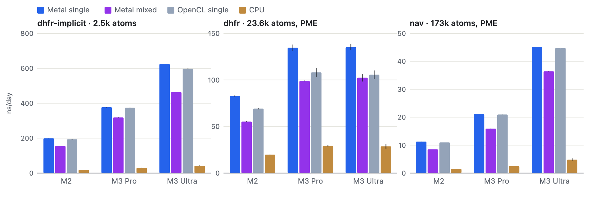
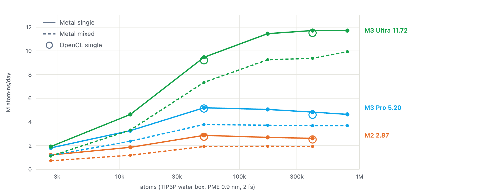

# Add a Metal platform

> **AI use:** built with Claude (Fable 5.1 and Opus 5.5) using a rigorous scientific and testing approach, under human supervision and direction. I have reviewed the code, I understand how it works, and I will answer review questions myself.

Related: #5397. See also #5416.

This adds a native Metal platform for Apple GPUs. Like CUDA and HIP, it is a thin `ComputeContext` implementation on the common compute framework, and every common kernel compiles unchanged. It is plain C++ using metal-cpp, which is header-only and vendored in `libraries/`. There is no Objective-C, and it builds with the Command Line Tools, without Xcode. `platforms/metal/src` is 6,557 lines, compared with 5,760 for HIP, 7,897 for CUDA and 8,845 for OpenCL.

**Command buffers.** Kernels encode into one open command buffer, which is committed only when the host needs a result. TestMetalCommandBatching measures 1.01 command buffers per step without a cutoff and 2.01 with PME.

**Precision.** Single precision is native. Apple GPUs have no fp64, so mixed precision uses float-float (df64) arithmetic, stored as IEEE doubles in device memory. Host code and array layouts are therefore the same as on the other platforms. There is no df64 version of the transcendentals. Applying one to a mixed-precision value is a compile error that names the function and the line, never a silent fallback to float. Double precision isn't offered.

## Performance

Folding@home work units (FAHBench) on three Apple GPUs, in ns/day. Clock: host wall clock over whole steps, 60 s after a 200-step warm-up; mean of 3 rotated rounds. Build f9347f6c5 on macOS 27.

| | Chip | Metal single | OpenCL single | Ratio | Metal mixed | CPU |
|---|---|--:|--:|--:|--:|--:|
| dhfr-implicit (2,489 atoms) | M2 (10 GPU cores) | 199.4 | 192.8 | 1.03 | 155.1 | 18.2 |
| | M3 Pro (18) | 377.2 | 374.2 | 1.01 | 318.6 | 30.0 |
| | M3 Ultra (60) | 624.8 | 598.2 | 1.04 | 464.2 | 42.3 |
| dhfr, PME (23,558) | M2 | 82.8 | 69.2 | **1.20** | 55.3 | 19.8 |
| | M3 Pro | 134.6 | 108.1 | **1.25** | 98.9 | 29.3 |
| | M3 Ultra | 135.2 | 105.7 | **1.28** | 102.5 | 28.8 |
| nav, PME (173,112) | M2 | 11.28 | 11.00 | 1.03 | 8.49 | 1.50 |
| | M3 Pro | 21.16 | 20.98 | 1.01 | 15.93 | 2.49 |
| | M3 Ultra | 45.13 | 44.76 | 1.01 | 36.42 | 4.81 |

The GPU standard deviation is under 1% in 19 of 27 cells and at most 4.3%. Apple's OpenCL can't run mixed precision at all, so Metal mixed is compared only with CPU.

Throughput plateaus with system size, and OpenCL plateaus at the same level. Per GPU core, the M2 and M3 Pro are equal (0.29 M atom·ns/day), and the M3 Ultra reaches 68% of that. A step never goes below about 0.24 ms, so dhfr is too small to fill the Ultra.

## Accuracy

On all three chips the relative force error against Reference is the same as OpenCL's: 1.21e-6 on dhfr, and 1.75e-6 on nav (OpenCL 1.80e-6). The energy error is at most 2.2e-6. Against a host double closed form, df64 is within 7e-15. NVE drift on dhfr over 0.1 ns is −53 to −177 kJ/mol/ns across all platforms and chips. CPU alone spans −53 to −160 across the three machines, so run-to-run variation dominates.

## Changes outside `platforms/metal`

- `CMakeLists.txt`: `OPENMM_BUILD_METAL_LIB`, on by default for arm64 macOS.
- `ComputeContext::doubleToString` is now virtual, so Metal can emit df64 constants. This changes the ABI: plugins must be rebuilt.
- A `PRIVATE` address-space macro for pointers to thread-local variables, empty on CUDA, OpenCL and HIP. A few `cond ? x : 0.0f` expressions become `(mixed) 0`. The generated code is the same on the other platforms.
- `minimize.cc`: without 64-bit atomics, the nine `atomicAddMixed` kernels run as a single threadgroup. On devices that have them, the launches are unchanged.
- `vkFFT.h`: fixes to VkFFT's Metal backend, all inside `VKFFT_BACKEND==5`.
- Licenses and user guide (metal-cpp is Apache 2.0).

## Tests

`ctest -R TestMetal` runs 110 tests (55 programs × single and mixed). OpenCL's tests are ported, plus new CommandBatching and MixedPrecision tests.

| Chip | Pass | Failures |
|---|---|---|
| M2 | 109 / 110 | LangevinMiddle mixed (stochastic), which passes on rerun |
| M3 Pro | 107 / 110 | one stochastic Brownian test, plus testLargeForces (single and mixed) |
| M3 Ultra | 108 / 110 | testLargeForces (single and mixed) |

`testLargeForces` also fails on unmodified main with OpenCL on both M3 chips, and passes on the M2. It predates this PR and is filed separately as #____.

## Limitations

- Mixed-precision minimization reduces within a single threadgroup: nav takes 264 s, against 58 s in single and 300 s on CPU.
- QTBIntegrator is single precision only.
- There is one device per context, so the multi-device tests are skipped.
- Requires macOS 15 or later and an Apple7 or newer GPU (M1 or later).
- I haven't tested on M1 or M4 hardware, or with OpenMM's own benchmark suite.
